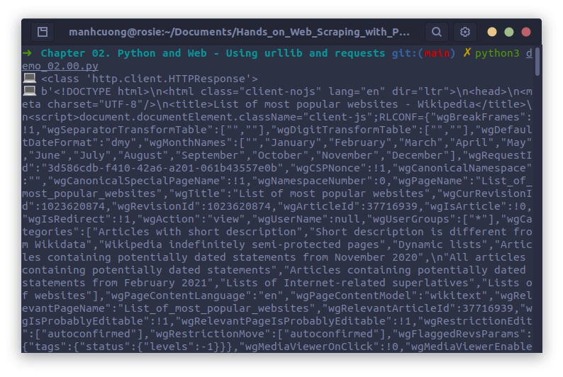

# 1. Technical requirements
# 2. Accessing the web with Python
## 2.1. Setting things up
## 2.2. Loading URLs
* Code dưới đây dùng để in ra web [https://en.wikipedia.org/wiki/List_of_most_popular_websites](https://en.wikipedia.org/wiki/List_of_most_popular_websites) sau khi crawl về:

###### [demo_02.00.py](demo_02.00.py)
