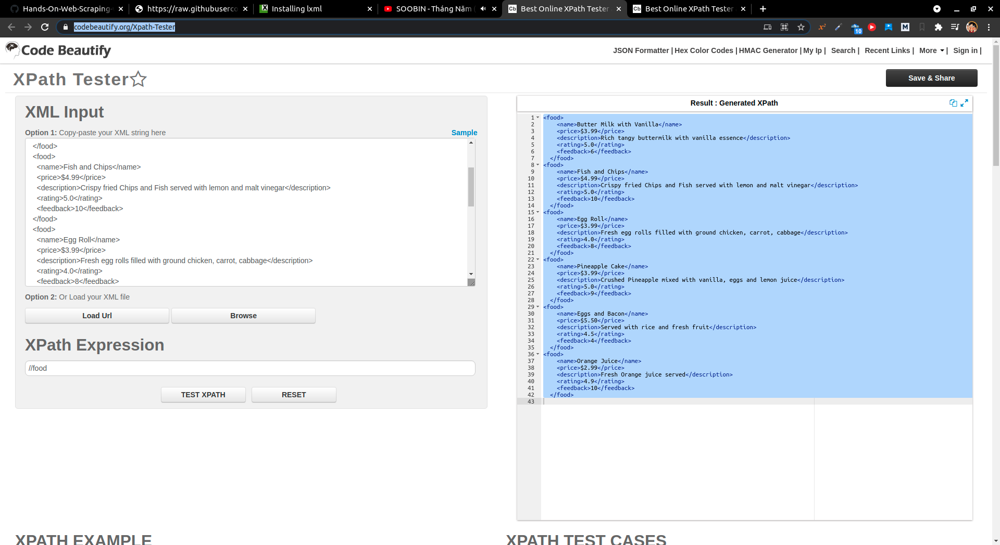
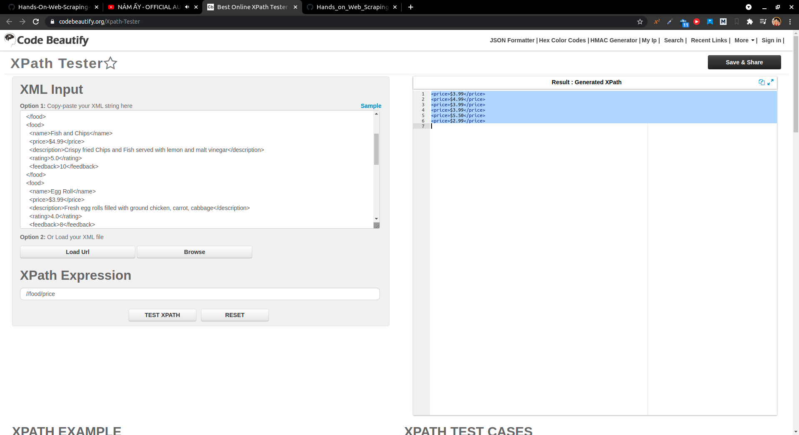

# 1. Technical requirements
# 2. Introduction to XPath and CSS selector
## 2.1. XPath
* Hãy cùng tìm hiểu cách sử dụng XPath qua tệp [`food.xml`](food.xml) dưới đây
```xml
<?xml version="1.0" encoding="UTF-8"?>
<menus>
  <food>
    <name>Butter Milk with Vanilla</name>
    <price>$3.99</price>
    <description>Rich tangy buttermilk with vanilla essence</description>
    <rating>5.0</rating>
    <feedback>6</feedback>
  </food>
  <food>
    <name>Fish and Chips</name>
    <price>$4.99</price>
    <description>Crispy fried Chips and Fish served with lemon and malt vinegar</description>
    <rating>5.0</rating>
    <feedback>10</feedback>
  </food>
  <food>
    <name>Egg Roll</name>
    <price>$3.99</price>
    <description>Fresh egg rolls filled with ground chicken, carrot, cabbage</description>
    <rating>4.0</rating>
    <feedback>8</feedback>
  </food>
  <food>
    <name>Pineapple Cake</name>
    <price>$3.99</price>
    <description>Crushed Pineapple mixed with vanilla, eggs and lemon juice</description>
    <rating>5.0</rating>
    <feedback>9</feedback>
  </food>
  <food>
    <name>Eggs and Bacon</name>
    <price>$5.50</price>
    <description>Served with rice and fresh fruit</description>
    <rating>4.5</rating>
    <feedback>4</feedback>
  </food>
  <food>
    <name>Orange Juice</name>
    <price>$2.99</price>
    <description>Fresh Orange juice served</description>
    <rating>4.9</rating>
    <feedback>10</feedback>
  </food>
</menus>
```
* Có thể sử dụng trang web [https://codebeautify.org/Xpath-Tester](https://codebeautify.org/Xpath-Tester) để kiểm tra XPath
* Ở đây ta thấy thẻ `<menus>` chứa nhiều thẻ `<food>` bên trong, để lấy tất các các thẻ `<food>` này, thì XPath-expression của chúng ta là:
  ```xpath
  //food
  ```
  

* Để lấy tất cả các thẻ `<price>`, thì XPath-expression là:
  ```xpath
  //food/price
  ```
  

* Dưới đây là các XPath-expression mà hay sử dụng:
  |XPath-expression|Mô tả|
  |-|-|
  |`//<tag>`|Chọn tất cả các thẻ `<tag>` trong tài liệu bất kể chúng nằm ở đâu, [ví dụ](images/03_00.png).|
  |`//*`|Chọn tất cả các thẻ trong tài liệu, [ví dụ](images/03_04.png).|
  |`*`|Chọn tất cả các thẻ, [ví dụ](images/03_03.png).|
  |`//food/name|//food/price`|Chọn tất cả thẻ `<name>` và `<price>` dc tìm thấy trong các thẻ `<food>`, [vi dụ](images/03_02.png).|
  |`//food/name`|Chọn tất cả thẻ `<name>` nằm bên trong thẻ `<food>`, [ví dụ](images/03_05.png).|
  |`//food/name/text()`|Lấy content của tất cả các thẻ `<name>` lồng bên trong thẻ `<food>`, [ví dụ](images/03_06.png).|
  |`//food/name|//rating`|Lấy tất cả thẻ `<rating>` hoặc thẻ `<name>` nằm lồng trong thẻ `<food>`, [ví dụ](images/03_07.png).|
  |`//food[1]/name`|Lấy thẻ `<name>` trong thẻ `<food>` đầu tiên tìm dc, [ví dụ](images/03_08.png).|
  |`//food[feedback<9]`|Lấy tất cả thẻ `<food>` mà có thẻ `<feedback>` nằm lồng bên trong nó nhỏ hơn 9, [ví dụ](images/03_09.png).|
  |`//food[feedback<9]/name`|Lấy tất cả thẻ `<name>` nằm lồng trong các thẻ `<food>` có thẻ `<feedback>` lồng bên trong nhỏ hơn 9, [ví dụ](images/03_10.png).|
  |`//food[last()]/name`|Chọn thẻ `<name>` lồng trong thẻ `<food>` cuối cùng, [ví dụ](images/03_11.png).|
  |`//food[last()]/name/text()`|Lấy content của thẻ `<name>` lồng trong thẻ `<food>` cuối cùng, [ví dụ](images/03_12.png).|
  |`sum(//food/feedback)`|Lấy tổng của tất cả thẻ `<feedback>` lồng trong thẻ `<food>`, [ví dụ](images/03_13.png).|
  |`//food[rating>3 and rating<5]/name`|Lấy tất cả thẻ `<food>` có thẻ `<rating>` lồng bên trong nằm trong khoảng $[3, 5]$, [ví dụ](images/03_14.png).|
  |`//food/name[contains(.,"Juice")]`|Chọn các thẻ `<name>` có chứa chuổi '**Juice**' nằm lồng trong thẻ `<food>`, [ví dụ](images/03_15.png).|
  |`//food/description[starts-with(.,"Fresh")]/text()`|Lấy content của các thẻ `<description>` bắt đầu bằng chuổi '**Fresh**' nằm lồng trong thẻ `<food>`, [ví dụ](images/03_16.png).|
  |`//food/description[starts-with(.,"Fresh")]`|Chọn các thẻ `<description>` bắt đầu bằng chuổi '**Fresh**' nằm lồng trong thẻ `<food>`, [ví dụ](images/03_17.png).|
  |`//food[position()<3]` <mark>**(XPath đánh số từ 1, ko phải từ 0)**</mark>|Chọn hai thẻ `<food>` đầu tiên, [ví dụ](images/03_18.png).|
