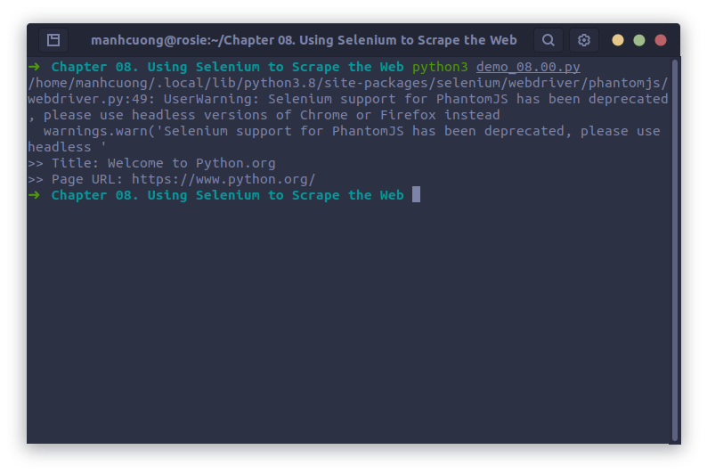
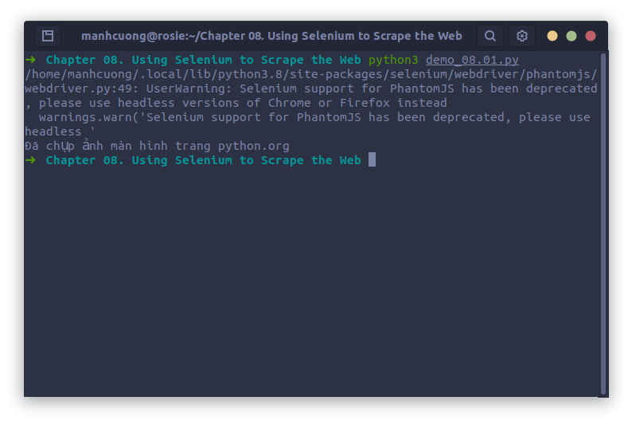
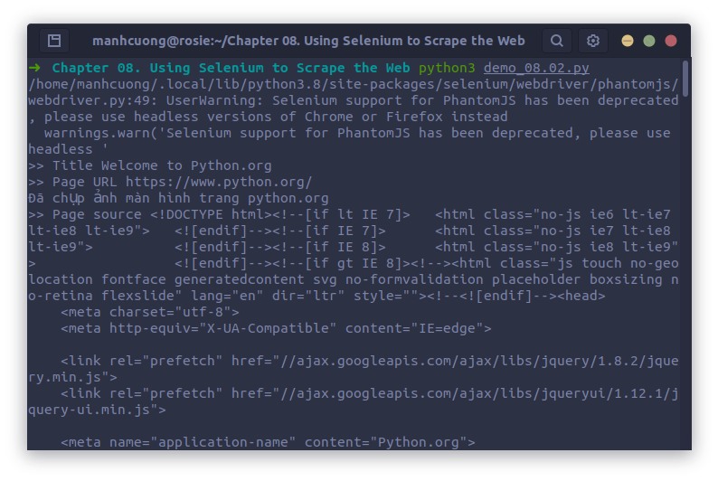

# 1. Technical requirements
# 2. Introduction to Selenium
## 2.1. Selenium projects
### 2.1.1. Selenium WebDriver
### 2.1.2. Selenium RC
### 2.1.3. Selenium Grid
### 2.1.4. Selenium IDE
## 2.2. Setting things up
## 2.3. Exploring Selenium
### 2.3.1. Accessing browser properties
* Code dưới đây sẽ lấy title và địa chỉ url của trang chủ Python:
###### [demo_08.00.py](demo_08.00.py)
```python
from selenium import webdriver
from selenium.webdriver.common.by import By

driver = webdriver.PhantomJS()
driver.get('https://www.python.org/')

print(f">> Title: {driver.title}")
print(f">> Page URL: {driver.current_url}")
```


<hr>

* Ngoài ra, Selenium cũng hỗ trợ chụp ảnh màn hình với code dưới đây:
###### [demo_08.01.py](demo_08.01.py)
```python
from selenium import webdriver
import re

driver = webdriver.PhantomJS()
driver.get('https://www.python.org/')

if re.search(r"python.org", driver.current_url):
    driver.save_screenshot("./images/python.org.png") # chụp ảnh màn hình và lưu lại
    print("Đã chụp ảnh màn hình trang python.org")
```

  [Đây là hình chụp màn hình](images/python.org.png)

###### [demo_08.02.py](demo_08.02.py)
```python
from selenium import webdriver
import re

driver = webdriver.PhantomJS()

driver.get("https://www.python.org")
print(f">> Title {driver.title}")
print(f">> Page URL {driver.current_url}")

if re.search(r"python.org", driver.current_url):
    driver.save_screenshot("./images/python.org_1.png")
    print("Đã chụp ảnh màn hình trang python.org")
    
cookies = driver.get_cookies()
print(f">> Page source {driver.page_source}")
print(f">> Cookies: {cookies}")

driver.refresh()

driver.get('https://www.google.com')
print(">> Title: ", driver.title)
print(">> Page URL: ", driver.current_url)

if re.search(r'google.com', driver.current_url):
    driver.save_screenshot("./images/google.png")
    print("Đã chụp ảnh màn hình google.com")
    
cookies = driver.get_cookies()
print(f">> Cookies: {cookies}")

print(f"Current URL {driver.current_url}")
driver.back()
print(f">> Back URL {driver.current_url}")
driver.forward()
print(f">> Forward URL {driver.current_url}")

driver.close()
driver.quit()`
```
